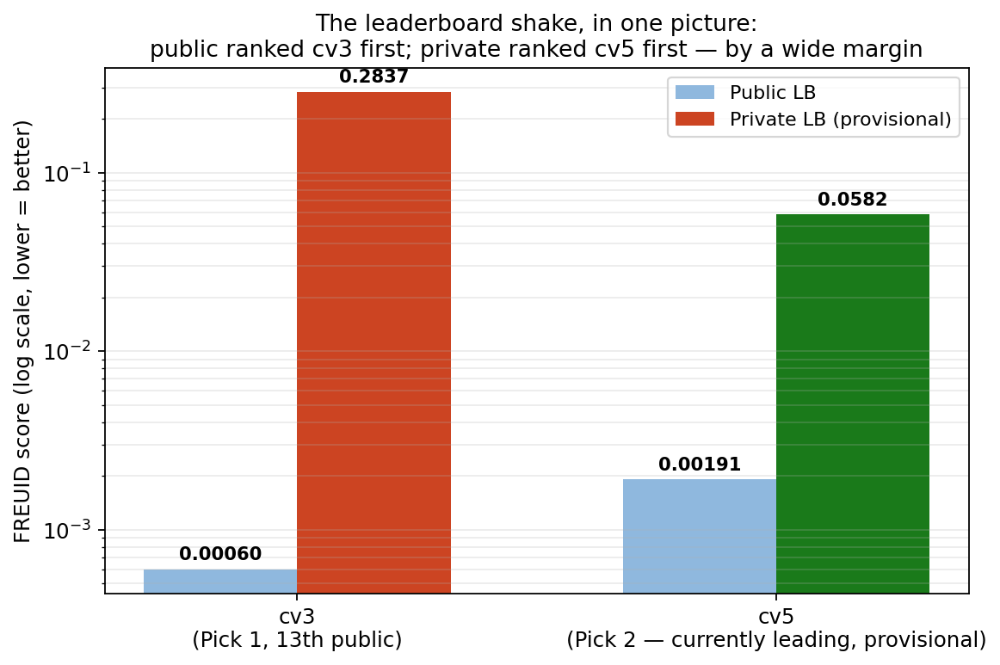
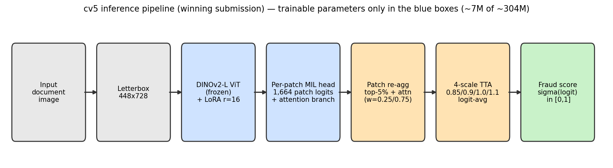
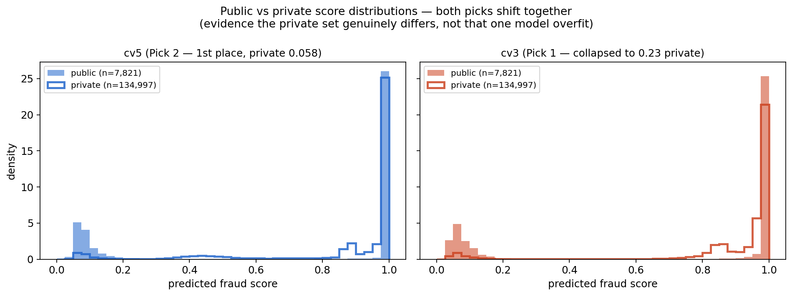
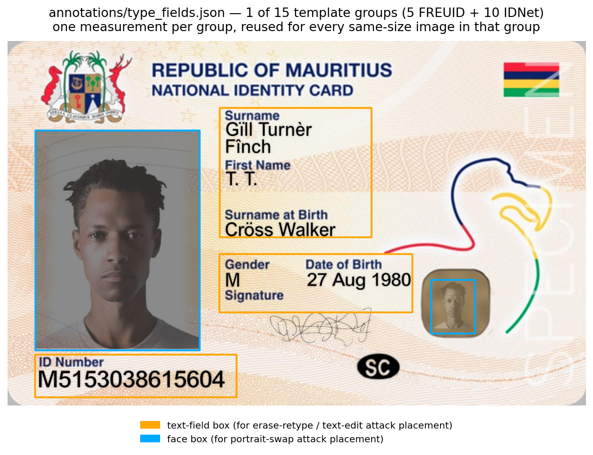

# 🏆 FREUID Challenge 2026 — Provisional Rank-1 Solution

**Team:** nadhir hasan (Nadhir Hasan) · **Kaggle username:** nadhirhasan

**Provisional result: currently ranked 1st** (private leaderboard results are
preliminary and pending organizer verification), private leaderboard score **0.0582**
(leading submission: `cv5_ep2`, Pick 2). This repository is the full reproducibility package: training code, inference code,
frozen model weights, and a runnable Docker container the organizers can execute in a
network-isolated sandbox to reproduce both of our two selected final submissions.



The public leaderboard ranked our two picks in the *opposite* order of the private
leaderboard. That reversal — and why our external-data model (`cv5_ep2`) survived it while our
best-public-scoring model (`cv3`) did not — is the central story of this repository. It is
explained in full in the [technical report](report/freuid_technical_report.pdf) and
summarized below.

## Contents

- [The leading submission — cv5](#the-leading-submission--cv5)
- [Why cv5 ranks ahead: the two-pick strategy explained](#why-cv5-ranks-ahead-the-two-pick-strategy-explained)
- [About `annotations/type_fields.json` — is this "manual labeling"?](#about-annotationstype_fieldsjson--is-this-manual-labeling)
- [Both selected final submissions](#both-selected-final-submissions)
- [Method summary](#method-summary)
- [Repository layout](#repository-layout)
- [Weight format (lean checkpoints)](#weight-format-lean-checkpoints)
- [Data](#data)
- [Training](#training)
- [Local inference (outside Docker)](#local-inference-outside-docker)
- [Docker / reproduction](#docker--reproduction)
- [Licenses](#licenses)

---

## The leading submission — cv5

`cv5_ep2` is a **DINOv2-L Vision Transformer** fine-tuned with a **LoRA adapter** (rank 16,
our own from-scratch implementation) and a **per-patch multiple-instance-learning (MIL)
head**, trained on **100% of the official FREUID training set plus 80,000 real identity
documents from the external IDNet dataset** (10 countries, CC0-licensed). At inference, its
raw prediction is refined by two post-processing steps selected entirely on held-out external
data: a **re-aggregation of the per-patch MIL scores** and **4-scale test-time augmentation
(TTA)**.



| | |
|---|---|
| **Backbone** | `vit_large_patch14_reg4_dinov2` (DINOv2-L, Apache-2.0), frozen |
| **Trainable parameters** | ~7M of ~304M (LoRA adapters + MIL head only) |
| **Training data** | 69,352 FREUID images (100%) + 80,000 IDNet images (10 countries, balanced) |
| **Resolution** | 448×728, letterboxed |
| **Inference-time enhancements** | patch re-aggregation (top-5% + attention, w=0.25/0.75) + 4-scale logit-avg TTA (0.85/0.9/1.0/1.1) |
| **Public leaderboard** | 0.00191 |
| **Private leaderboard (provisional)** | **0.0582 — currently rank 1** |

Everything needed to retrain, re-run, and independently verify this exact model is in this
repository — see [Training](#training) and [Docker / reproduction](#docker--reproduction).

## Why cv5 ranks ahead: the two-pick strategy explained

Kaggle allowed two final submission picks. We deliberately selected two models trained on
**different data regimes**, expecting that if the private test set (which the organizers
stated up front contains *"previously unseen document types and fraud patterns... intentionally
withheld"*) diverged from the public distribution, the two picks would diverge with it —
giving us a hedge instead of a single bet.

- **Pick 1 (`cv3`):** trained on FREUID data only. Best public score by far (0.00060, 13th
  place on the public leaderboard), and strong performance on a genuinely held-out,
  corruption-augmented slice of FREUID itself.
  But on 35,874 real-world IDNet documents it never trained on, it scored at **chance level**
  (AuDET ≈ 0.50) — it had learned something highly specific to FREUID's own generation
  pipeline, with no evidence it would transfer to a different document distribution.
- **Pick 2 (`cv5_ep2`, the stronger-ranking pick on private data):** trained on FREUID **plus** a large, diverse
  slice of real identity documents. Nearly identical *ranking* of public-test images to `cv3`
  (Pearson 0.994) — so nothing was sacrificed on the data both picks were validated against —
  but a **measured, order-of-magnitude better** score (0.0116 vs. chance) on the external
  documents `cv3` failed on.

That gap between "does well on data resembling training" and "does well on data it has never
seen" is exactly what a private leaderboard is designed to expose. It did:



Both models' prediction distributions shifted by a similar amount from public to private data
(see the technical report's diversity/overfitting analysis for the full statistics) — but only
one of them had ever been shown to handle that kind of shift correctly *before* the private
set was released. That evidence — not the public leaderboard number — is what we built the
final decision on, and it is what currently separates a leading private-LB rank from
a solution that would have finished far lower.

## About `annotations/type_fields.json` — is this "manual labeling"?

Short answer: **no** — but here is the full, explicit explanation, because this file is the
one place in our pipeline that involved manual work, and we want it to be unambiguous under
audit.

`annotations/type_fields.json` records, for each of the 5 FREUID document types and 10 IDNet
countries, the **pixel location of the face photo and text fields on that document template**
— nothing more. It looks like this for one document type:



These boxes are **not a fraud/genuine label**, and they are **never applied to test or private
data in any way**. Their only use is at **training time**, to place our synthetic fraud
attacks (portrait swap, text-field edit, erase-and-retype) realistically on top of *genuine
training images* — e.g. "the face goes here, not in the middle of the signature" — instead of
pasting them at a random location. This is a geometric template annotation for a data
augmentation tool, comparable in kind to specifying crop windows or keypoints for an image
pipeline; it is categorically different from a human looking at a document and deciding "this
one is fraudulent."

The actual fraud/genuine ground truth used everywhere in this project comes **exclusively**
from the organizer-provided `train_labels.csv` and IDNet's own published metadata. No label
was ever created, inferred, or altered by us. And the final predictions in both submitted CSVs
were produced **entirely** by the deterministic Docker pipeline described below — no manual
score assignment or adjustment occurred anywhere, on any image, at any stage. We independently
verified this by re-running the container end-to-end and confirming rank-identical output to
the actual Kaggle submissions (see [Docker / reproduction](#docker--reproduction)).

## Both selected final submissions

| Pick | Model | Training data | Public LB (rank) | Private LB | Kaggle CSV (sha256) |
|---|---|---|---|---|---|
| 1 | `cv3` | FREUID only (fold-0 split, ~80% of train) | 0.00060 (13th) | 0.2837 | `final_cv3_pagg_tta4_full.csv` — `d31f9b0163da7b3aa374b4c92cc2781b47650992c5655afcc46d381492c06048` |
| **2 (leading)** | `cv5_ep2` | 100% FREUID + 80k IDNet images (all 10 countries) | 0.00191 | **0.0582** | `final_cv5_pagg_tta4_full.csv` — `c757f5ce81388fcd2796170387d2a75b4c87b96b383c617aa8aea72f2d9e0c5a` |

Both picks use **identical inference-time options** — patch re-aggregation (top-5% of patch
logits, branch weight 0.25) plus 4-scale logit-averaged TTA (0.85/0.9/1.0/1.1) — and come from
the **same frozen commit**; they differ *only* in the weights file, selected by one documented
environment variable (organizer-confirmed as inference orchestration under the code-freeze
rules — see [Docker / reproduction](#docker--reproduction) for the exact commands and the full
submission ↔ command ↔ checksum mapping).

Checksums are of the exact final CSVs uploaded to Kaggle (public-row predictions frozen since
our pre-code-freeze probes; private rows predicted after the private release with the frozen
weights, inference only, via `src/infer_private.py`). Bit-exact float reproduction across
different GPU hardware is not guaranteed; rank-identical scores are.

## Method summary

- **Architecture:** DINOv2-L ViT (`vit_large_patch14_reg4_dinov2`, Apache-2.0, loaded via
  [`timm`](https://github.com/huggingface/pytorch-image-models)) with a LoRA adapter (rank 16,
  our own minimal from-scratch implementation, no `peft` dependency — see
  [`src/lora.py`](src/lora.py)) and a per-patch MIL classification head
  ([`src/model.py`](src/model.py)).
- **Synthetic fraud generation:** an annotation-driven attack suite (portrait swap, cross-card
  region swap, text-field edit, erase-and-retype) placed using the manually annotated
  face/field boxes described [above](#about-annotationstype_fieldsjson--is-this-manual-labeling),
  implemented in [`src/augment.py`](src/augment.py).
- **Resolution:** 448×728, letterboxed (aspect-preserving).
- **Loss:** Focal BCE (α=0.25, γ=2.0) on the whole-image logit.
- **Validation / selection protocol:** in-domain FREUID validation does not reliably predict
  generalization (established repeatedly during development), so every design decision that
  could be validated (checkpoint selection for `cv5`, the TTA grid, patch-aggregation sweep)
  was scored with the exact competition metric ([`src/freuid_metric.py`](src/freuid_metric.py))
  on held-out IDNet data. The metric is invariant to monotone score transforms, so no score
  calibration of any kind is applied (provably a no-op — see the technical report).

## Repository layout

```
src/                  Training + inference + evaluation code
  train.py            Main training script (see "Training" below for exact commands)
  model.py, lora.py   Model architecture
  data.py             Image loading / letterbox / normalization
  augment.py          Augmentation + annotation-driven synthetic attack generation
  freuid_metric.py    Exact competition metric (AuDET, APCER@1%BPCER, harmonic mean)
  infer.py            Batch inference -> Kaggle-format submission CSV (supports --tta_scales)
  infer_patchagg.py   Inference with patch re-aggregation + TTA (used by both final picks)
  infer_private.py    Crash-safe private-set inference + merge with pre-freeze public predictions
  eval_external.py    Unified external-generalization eval (IDNet EST+SVK pool)
  tta_grid.py          TTA scale-combination grid (how the 4-scale TTA was selected)
  tta_confirm_full.py  Full-pool confirmation of the selected TTA config
  patch_agg_grid.py    Patch-aggregation sweep
  pagg_tta_combo.py     Combined patch-agg x TTA validation grid
  make_lean_ckpt.py    Converts full checkpoints -> lean (trained-params-only) weight files
  make_splits.py       Regenerates splits/folds.csv (stratified 5-fold, seed 42)
annotations/
  type_fields.json    Manual per-document-type face/text-field bounding boxes (see above)
splits/
  folds.csv           Stratified 5-fold split of the FREUID training set (fold 0 used)
weights/
  cv3_fold0.pt        Pick 1: FREUID-only, fold 0, epoch 1 — LEAN checkpoint
  cv5_full_ep2.pt     Pick 2 (leading, provisional): full-data FREUID+IDNet, epoch 2 — LEAN checkpoint
Dockerfile            Reproducibility container (see "Docker / reproduction" below)
docker/
  prepare_submission.py  Container entrypoint (loads weights, runs inference + TTA + pagg)
  requirements.txt       Pinned inference dependencies
report/
  freuid_technical_report.pdf / .tex   Full technical report
  figures/                             Report figures (also embedded in this README)
```

## Weight format (lean checkpoints)

The `weights/*.pt` files are **lean checkpoints**: they contain only the parameters that
training actually changed — 192 LoRA A/B matrices + 8 head tensors, ~27 MB each (plain git
files, no Git LFS needed). The DINOv2-L backbone is frozen during training, so at load time it
is rebuilt from the official `timm` pretrained weights (Apache-2.0): the Dockerfile downloads
them **at build time** into the image's HF cache; container runtime performs no network
access.

This conversion is lossless and audited by [`src/make_lean_ckpt.py`](src/make_lean_ckpt.py)
(run with `--verify`): every backbone tensor in the full training checkpoints is bit-identical
to the timm release (343/343), and lean-loaded models produce bit-identical fp32 logits to the
full checkpoints.

## Data

- **FREUID Challenge dataset:** obtain from the official Kaggle competition page and place
  under `the-freuid-challenge-dataset/` at the repo root (`train/`, `train_labels.csv`, ...)
  matching [`src/data.py`](src/data.py)'s expected layout.
- **IDNet** (used by `cv5_ep2` training and by the external validation protocol): **CC0**
  (public domain), obtain from the dataset's official release and build a flat index CSV
  (`id,path,label,type,source`) at `external/idnet_cropped_index.csv`; `type` values are
  per-country codes (e.g. `ESP_scanned`, `EST_scanned`, ...).

Neither dataset is redistributed in this repository (size + competition terms); only the code
and our own field/face annotations are included.

## Training

**Leading model — `cv5_ep2` (100% FREUID + all-10-country IDNet):**

```bash
python src/train.py \
    --full_data --epochs 5 --bs 6 --accum 4 --eval_bs 8 \
    --res 448x728 --sbi 0.25 --attacks full \
    --idnet_countries ESP_scanned,ALB_scanned,AZE_scanned,FIN_scanned,GRC_scanned,LVA_scanned,RUS_scanned,SRB_scanned,EST_scanned,SVK_scanned \
    --heldout_idnet "" --idn_val_from_unused \
    --lim_idn 80000 --idn_val_n 4000 --select_on idnet \
    --workers 16 --save_every 250 --tag cv5
```

This trains on ~149k images/epoch (69,352 FREUID + 80,000 balanced IDNet rows); per-epoch
validation uses 4,000 IDNet images sampled from the pool rows **not** selected into the 80k
training cap (same countries, zero row overlap — a genuinely disjoint, leak-free validation
signal). The submitted checkpoint is **epoch 2** (`weights/cv5_full_ep2.pt`), selected because
epoch 3's local validation score improved further but a leaderboard probe showed it scoring
*worse* — a reminder that we treated every local metric as directional evidence only, never as
ground truth. Training used a single NVIDIA RTX A4500 (20GB); ≈5h/epoch at this configuration.

**Pick 1 — `cv3` (FREUID-only, fold 0):**

```bash
python src/train.py \
    --fold 0 --epochs 3 --bs 6 --accum 4 --eval_bs 8 \
    --res 448x728 --sbi 0.25 --attacks full \
    --idnet_countries "" \
    --workers 16 --tag cv3
```

The submitted checkpoint is epoch 1 of this run (`weights/cv3_fold0.pt`).

## Local inference (outside Docker)

[`src/infer_patchagg.py`](src/infer_patchagg.py) implements the patch re-aggregation
(top-5%, w=0.25) used by both final picks:

```bash
# Leading model: cv5_ep2 + patch re-agg + 4-scale TTA
python src/infer_patchagg.py --ckpt weights/cv5_full_ep2.pt \
    --tta_scales 0.85,0.9,1.0,1.1 --out sub_cv5_full_ep2_pagg_tta4.csv

# Pick 1: cv3 + patch re-agg + 4-scale TTA
python src/infer_patchagg.py --ckpt weights/cv3_fold0.pt \
    --tta_scales 0.85,0.9,1.0,1.1 --out sub_cv3_pagg_tta4.csv
```

## Docker / reproduction

One image reproduces both selected final picks; the pick is chosen by a single documented
environment variable (inference orchestration only — same frozen weights, identical TTA and
patch-aggregation settings for both picks).

```bash
docker build -t freuid-repro:local .

# LEADING SUBMISSION (provisional) — reproduces Kaggle submission "final_cv5_pagg_tta4_full.csv"
# (cv5_ep2 weights + patch re-agg top-5%/w=0.25 + 4-scale TTA):
docker run --rm --gpus all \
  --network none \
  -e FREUID_MODEL_PATH=/models/cv5_full_ep2.pt \
  -v /path/to/flat/test/images:/data:ro \
  -v "$(pwd)/out:/submissions" \
  freuid-repro:local

# PICK 1 — reproduces Kaggle submission "final_cv3_pagg_tta4_full.csv"
# (cv3 weights; these are the image defaults, so no -e flag is needed):
docker run --rm --gpus all \
  --network none \
  -v /path/to/flat/test/images:/data:ro \
  -v "$(pwd)/out:/submissions" \
  freuid-repro:local
```

Measured inference cost (RTX A4500, 20 GB): ~160 ms/image for the 4-scale TTA configuration
used by both picks (images decoded once, decode overlapped with GPU compute via threaded
prefetch) — ~6.3 h for the full 142,818-image hidden set on our A4500, i.e. approximately 2–3 h
on an A100 (2–3× faster on FP16 throughput and memory bandwidth), within the 6 h limit. Batch
size and decode threads are tunable via `FREUID_BATCH_SIZE` (default 32) and
`FREUID_DECODE_THREADS` (default 8) if more headroom is desired.

`docker/prepare_submission.py` discovers every image directly under `/data/`
(`.jpeg/.jpg/.png/.webp/.bmp/.tif/.tiff`), runs the same DINOv2-L+LoRA model and preprocessing
used in training/validation, and writes `/submissions/submission.csv` with columns `id,label`
(`id` = filename stem, `label` = fraud score, higher = more confident fraudulent). No network
access is required or used at inference time; both finalist weights are baked into the image
under `/models/`.

## Licenses

- This repository's code: **MIT** (see [`LICENSE`](LICENSE)).
- DINOv2 backbone weights/architecture (via `timm`): **Apache-2.0**.
- IDNet training data: **CC0** (public domain; not redistributed here — see [Data](#data)).
- We deliberately avoided any non-OSI-licensed code or weights (e.g. TruFor, ConvNeXt V2,
  DINOv3) anywhere in the pipeline used for this submission.
